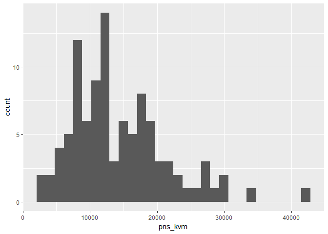

# Webscrape Boliga

## What does it do?

This package has a few helper functions to webscrape the content of [home sales prices from Boliga](http://www.boliga.dk/salg/).

This package will try to follow the [Ethical Scraper](https://medium.com/@jamesdensmore/ethics-in-web-scraping-b96b18136f01) guidelines.

## This is how you use it

First of all, you need to install the package using devtools.


```r
library(devtools)

if(!require(boliga)){
  install_github("krose/boliga")
}
```

```
## Loading required package: boliga
```


It is rather simple to use. You only need to do the following to scrape the actual sales prices for an area from [Boliga's](https://www.boliga.dk/salg/) homepage:


```r
library(boliga)
library(dplyr)
library(ggplot2)

boliger <- boliga_webscrape_sold(min_sale_date = "2017-04-01", 
                                 max_sale_date = "2017-06-30", 
                                 type = "Fritidshus", 
                                 postal_code = 4500)

glimpse(boliger)
```

```
## Observations: 102
## Variables: 11
## $ vej         <chr> "A Olufsensvej 4", "Elvervangen 7", "Pilevangsvej ...
## $ rum         <int> 3, 4, 3, 4, 3, 5, 4, 4, 2, 3, 4, 3, 4, 3, 4, 4, 2,...
## $ boligtype   <chr> "Sommerhus", "Sommerhus", "Sommerhus", "Sommerhus"...
## $ kvm         <int> 35, 65, 35, 71, 62, 82, 52, 71, 42, 40, 73, 57, 76...
## $ bygget      <int> 1958, 1971, 1974, 2011, 2004, 1963, 1942, 1969, 19...
## $ udbudsrabat <dbl> 0.10, NA, 0.00, -0.04, -0.04, NA, NA, 0.01, -0.08,...
## $ pris        <dbl> 657000, 570000, 1995000, 1535000, 1650000, 537075,...
## $ post_by     <chr> "4500 Nykøbing Sj", "4500 Nykøbing Sj", "4500 Nykø...
## $ pris_kvm    <dbl> 18771, 8769, 57000, 21619, 26612, 6549, 5230, 5211...
## $ dato        <date> 2017-06-30, 2017-06-29, 2017-06-29, 2017-06-27, 2...
## $ type        <chr> "Alm. Salg", "Alm. Salg", "Alm. Salg", "Alm. Salg"...
```

I just bought a summer house in Nykøbing Sj. so let's see how the distribution of prices is for the 2nd quarter of 2017.


```r
ggplot(boliger %>% filter(pris_kvm < 50000), aes(pris_kvm)) +
  geom_histogram()
```

<!-- -->


