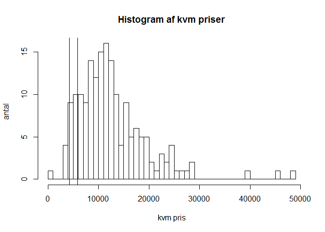

This package has a few helper functions to webscrape the content of
boliga.

It is rather simple to use. You only need to do the following to scrape
the actual sales prices for an area that you define on the
(boliga)[www.boliga.dk] homepage. You only need to do the following:

-   Go to quick search page on (boliga.dk/salg)[www.boliga.dk/salg]
-   Make an appropiate search
-   Copy the url into the function boliga\_webscrape\_sold.

Clap your hands when the data is returned.

    library(boliga)

    # The url is from boliga.dk/salg -> 
    # Hurtigsøgning:boligtype(fritdishuse), hurigsøgning:postnummer(4500) and then press "søg"
    # Jeg har splittet url'en op i paste0 fordi at den er så lang.

    boliger <- boliga_webscrape_sold(url_address = paste0("http://www.boliga.dk/salg/resultater?so=1&",
                                                          "sort=omregnings_dato-d&maxsaledate=today&",
                                                          "type=Fritidshus&iPostnr=4500&",
                                                          "gade=&minsaledate=2015"))

    # boliger <- webscrape_boliga_sold(url_address = "http://www.boliga.dk/salg/resultater?so=1&type=Fritidshus&kom=&fraPostnr=&tilPostnr=&gade=&min=&max=&byggetMin=&byggetMax=&minRooms=&maxRooms=&minSize=&maxSize=&minsaledate=2014&maxsaledate=today&kode=")

I just bought a summer house in Nykøbing Sj. so let's see how the
distribution of prices are now compared to the price I payed for the
house.

    hist(boliger$pris_kvm, 
         xlab = "kvm pris", 
         ylab = "antal",
         breaks = 50, 
         main = "Histogram af kvm priser")
    abline(v = 535000 / 126)

Phew... That's not to bad!
